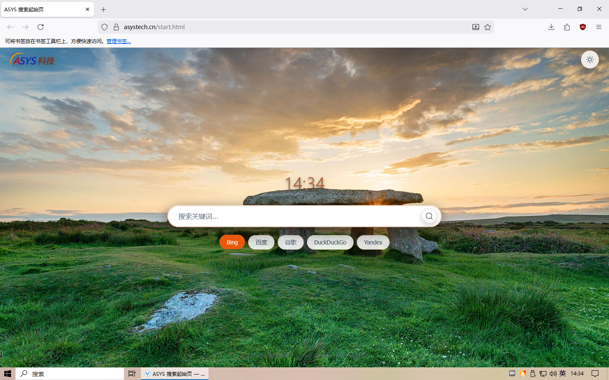

# Vantage Browser

[简体中文](README.md)

> **Private · Fast · Easy to use**

[](https://asystech.cn/vantage)
[](LICENSE)
[](https://github.com/asystech-chen/Vantage)

## Screenshot



---

## 📋 Table of Contents

- [What is Vantage?](#-what-is-vantage)
- [⭐ What makes Vantage special](#-what-makes-vantage-special)
- [🗺️ Roadmap](#️-roadmap)
- [Core features](#core-features)
- [🖥️ System requirements](#️-system-requirements)
- [📦 Installation](#-installation)
- [🔨 Build](#-build)
- [⚙️ Configuration & usage](#️-configuration--usage)
- [🤝 Contributing](#-contributing)
- [❓ FAQ](#-faq)
- [📄 License](#-license)
- [🔗 Links](#-links)

---

## 🗺️ Roadmap

### Migrated to the ESR channel

Vantage has migrated to the **Firefox ESR (Extended Support Release)** channel, with ESR 153 as the current baseline:

- **More stable**: ESR ships one major version per year and only receives security fixes in between
- **Lower maintenance cost**: fewer upstream changes mean less work to adapt patches
- **Stable APIs**: autoconfig, extension, and system-integration interfaces change less often
- **Going forward**: continue following the ESR 153 maintenance releases (153.0.xesr); the next ESR major version is expected around 2027

### ✨ Feature progress

| Status | Features |
|:---:|---|
| ✅ Shipped | Toolbar "multi-threaded download" toggle, "find bar floating at the top-right", right-click "Copy as Markdown link" / "Open in IE", toolbar "Reopen last closed", automatic tab sleep, AI sidebar, local DoH optimization, Nova appearance |
| 🧪 Planned | Windows PE single-file self-extracting package, handling of links for Chromium-based browsers, more right-click enhancements |

---

## 🔍 What is Vantage?

**Vantage** is a browser deeply customized by **ASYS Technology**, built on **Firefox ESR** as its engine baseline and focused on being **private · fast · easy to use**.

> ⚠️ Vantage is not affiliated with or commercially associated with LibreWolf or Mozilla in any way.

Our goal: keep Firefox's powerful extension ecosystem while giving users a privacy-enhanced experience out of the box — free from tracking, telemetry, and unnecessary distractions.

---

## ⭐ What makes Vantage special

> Deep customization on top of Firefox ESR, aimed at Chinese-speaking users and local network environments.

| Advantage | Description |
|---|---|
| 🎯 **Stable ESR engine** | Built on the Firefox ESR channel for long-term engine stability; Vantage features keep landing and versions keep updating |
| 🌏 **Local network optimization** | DoH enabled by default (Alibaba / Tencent, with automatic fallback to system DNS), switchable provider, no disconnects on intranets / VPNs |
| 🤖 **AI sidebar, ready to use** | Built-in DeepSeek / Qwen / Doubao — open the sidebar and start chatting |
| 🧊 **Nova appearance** | Built-in Nova interface + Vantage blue-green theme, switchable in one click from Settings |
| ⚡ **Multi-threaded download** | Built-in multi-threaded downloads with a one-click toolbar toggle |
| 🔍 **Find bar at the top-right** | Optionally move the find bar to the top-right, with Chromium-style compact `x/y` counting |
| 🀄 **Deep Chinese adaptation** | Chinese installer and UI, region defaulting to CN, plus an extra Chinese language pack |
| 🧷 **Right-click enhancements** | "Copy as Markdown link", "Open in IE" (Windows) |
| 🛌 **Automatic tab sleep** | Automatically sleeps inactive tabs under memory pressure to free up RAM |
| 🚫 **No telemetry by default** | Telemetry, experiments, and ad push are fully disabled |
| 🧩 **uBlock Origin preinstalled** | Content-blocking extension preinstalled; more privacy extensions can be installed optionally |
| 🖥️ **All platforms, multiple channels** | Windows (x64/arm64), Linux (x86_64/aarch64/LoongArch64); winget / MSIX / deb / rpm / AppImage / portable |
| 📦 **LTO / PGO build** | Built with LTO / PGO and trimmed language packs for better runtime performance and a smaller package |

---

## Core features

**Performance & experience**

- Native support for multiple architectures: Windows x64 / arm64, Linux x86_64 / aarch64 / LoongArch64
- AI sidebar: built-in DeepSeek, Qwen, and Doubao — ready as soon as you open the sidebar
- Toolbar buttons such as "Reopen last closed" and "Multi-threaded download"; wheel to switch tabs, double-click to close
- Automatically sleeps inactive tabs under memory pressure
- Multiple installation channels: winget / MSIX / deb / rpm / AppImage / portable

**Privacy & security**

- Telemetry, experiments, and ad push fully disabled; no data collection by default
- RFP fingerprinting protection, WebRTC leak prevention, enforced HTTPS
- DoH enabled by default (Alibaba / Tencent optimized for China, with automatic fallback to system DNS)
- uBlock Origin preinstalled; optional privacy-enhancing extensions

**Usability & customization**

- Dedicated settings panel at `about:preferences#vantage`, centralizing update checks, AI, and privacy policies
- Flexible search engines: several built in (including Baidu and other China-friendly options), switchable to Google, DuckDuckGo, and more
- Optional Mozilla account sync for bookmarks and extensions
- Open source and transparent: MPL-2.0 license, auditable source code

---

## 🖥️ System requirements

### Windows
- **OS**: Windows 10 / 11 (64-bit)
- **Processor**: x64-compatible processor
- **Memory**: ≥ 4 GB RAM
- **Storage**: ≥ 500 MB free space
- **Graphics**: GPU with DirectX 11 support (hardware acceleration)

### Linux
- **x86_64**: most mainstream distributions (Debian / Ubuntu / Fedora / Arch, etc.)
- **aarch64**: ARM64 devices (Raspberry Pi, some domestic ARM platforms, etc.)
- **LoongArch64**: Loongson 3A6000+ and compatible processors, with Debian Ports / Arch Linux support
- **Dependencies**: the packages already include common dependencies; playing H.264/AAC video on sites such as Bilibili also needs the system FFmpeg (libavcodec). The deb/rpm packages declare it as a recommended dependency (installed by default by apt/dnf/zypper); the official Fedora and openSUSE repositories satisfy it, while RHEL/Rocky/Alma require enabling RPM Fusion first. For AppImage/portable builds, install it manually — see the FAQ

---

## 📦 Installation

### Windows users
1. Visit the official download page: [https://asystech.cn/vantage](https://asystech.cn/vantage)
2. Download the installer
3. Double-click to run it and follow the wizard
4. Launch Vantage and start browsing privately ✨

### Linux users

Download the package for your distribution from the [official website](https://asystech.cn/vantage) or [Releases](https://github.com/asystech-chen/Vantage/releases/latest) (file names look like `vantage_<version>_<arch>.deb`, `vantage-<version>.<arch>.rpm`, `vantage-<version>.<arch>.AppImage`).

**Debian / Ubuntu (deb)**
```bash
cd ~
sudo apt update
sudo apt install -y ./vantage_*_amd64.deb
```

**Fedora / RHEL / Rocky (rpm)**
```bash
cd ~
sudo dnf install -y ./vantage-*.x86_64.rpm
```
> openSUSE uses `sudo zypper install`; on RHEL / Rocky / Alma, enable RPM Fusion afterwards if you need H.264 video playback (see the FAQ).

**Other distributions (AppImage)**
```bash
chmod +x vantage-*.x86_64.AppImage
./vantage-*.x86_64.AppImage
```

**Manual install from archive (tar.xz / tar.gz)**
```bash
tar -xf vantage-<version>.linux-x86_64.tar.xz -C /opt/
ln -s /opt/vantage/vantage /usr/local/bin/vantage
```


---

## 🔨 Build

### Using build.sh

```bash
# Interactive target selection
./build.sh

# Build for specific targets
./build.sh linux-x64 linux-arm64 linux-loong64
./build.sh windows-x64 windows-arm64

# Short aliases
./build.sh lx      # linux-x64
./build.sh la      # linux-arm64
./build.sh ll      # linux-loong64
./build.sh wx      # windows-x64
./build.sh wa      # windows-arm64

# Package only (skip the build)
./build.sh package linux-x64

# Sign existing artifacts only (skip build and packaging; Linux only)
./build.sh sign linux-x64
```

The build pipeline automatically includes: **build → package → sign** (Linux targets produce deb / rpm / AppImage / tar.gz in four formats with GPG signatures).

### Manual build

```bash
MOZCONFIG=$(pwd)/assets/mozconfig.new make build            # Linux x86_64
MOZCONFIG=$(pwd)/assets/mozconfig.linux-arm64 make build    # Linux arm64
MOZCONFIG=$(pwd)/assets/mozconfig.linux-loong64 make build  # Linux LoongArch64
MOZCONFIG=$(pwd)/assets/mozconfig.win-cross make build      # Windows x64 (cross-compile)
MOZCONFIG=$(pwd)/assets/mozconfig.win-cross.arm64 make build # Windows arm64 (cross-compile)
```

### LoongArch64 cross-compilation

See [`docs/LOONG64-CROSS-COMPILE.md`](docs/LOONG64-CROSS-COMPILE.md)

---

## ⚙️ Configuration & usage

### Suggested first-run checklist
- ✅ Visit `about:preferences#vantage` to explore Vantage-specific settings (update checks, AI sidebar, privacy policy, etc.)
- ✅ Review the privacy settings under `about:preferences#privacy`
- ✅ Enable or disable Mozilla sync as you prefer
- ✅ Install the extensions you use (Vantage is compatible with the Firefox add-on store)

### Advanced configuration (about:config)
> ⚠️ Back up your configuration before making changes; improper settings may affect browser stability

```ini
# Example: further disable telemetry (already disabled by default; for reference)
datareporting.healthreport.uploadEnabled = false
toolkit.telemetry.enabled = false
browser.ping-centre.telemetry = false

# Example: DNS over HTTPS (Vantage already enables China-friendly DoH by default; shown here for customization)
network.trr.mode = 3
network.trr.uri = "https://dns.alidns.com/dns-query"    # Alibaba DNS
# network.trr.uri = "https://doh.pub/dns-query"         # Tencent DNSPod
```

---

## 🤝 Contributing

We welcome contributions of any kind! 🎉

### You can:
- 🐛 File bug reports (please include reproduction steps and environment details)
- 💡 Suggest new features
- 🔧 Submit pull requests that fix issues or enhance functionality
- 🌍 Help translate and localize content
- 📝 Improve the documentation and tutorials

### Contribution workflow
1. Fork this repository
2. Create a feature branch: `git checkout -b feat/your-feature`
3. Commit your changes: `git commit -am 'feat: add XXX'`
4. Push the branch: `git push origin feat/your-feature`
5. Open a pull request

> 📌 Please make sure your code follows the [Mozilla coding style](https://firefox-source-docs.mozilla.org/code-quality/) and passes basic tests.

---

## ❓ FAQ

**Q: What is the difference between Vantage and Firefox / LibreWolf?**  
A: Vantage uses **Firefox ESR** as its engine baseline (it was initially built on the LibreWolf codebase) and is further customized by ASYS Technology for Chinese-speaking users' habits and privacy needs, shipping with search and blocking strategies better suited to local use.

**Q: Are extensions compatible?**  
A: ✅ Fully compatible with extensions from the Firefox add-on store (addons.mozilla.org); you can install and use them directly.

**Q: Does sync leak my privacy?**  
A: Sync is off by default. If you enable it, data is transmitted encrypted through Mozilla's servers; we do not collect sync content separately.

**Q: On Linux, Bilibili / video sites say the browser doesn't support playback?**  
A: Firefox-based browsers on Linux rely on the **system FFmpeg (libavcodec)** to decode H.264/AAC; without it, video sites decide the browser can't play. Windows builds use the system's built-in decoder components and are unaffected. To install:

```bash
# Debian / Ubuntu (the deb package already declares it as recommended, usually no manual step needed)
sudo apt install ffmpeg
# Fedora (official repo)
sudo dnf install ffmpeg-free openh264
# openSUSE (official repo)
sudo zypper install ffmpeg-7
# RHEL / Rocky / Alma (enable RPM Fusion first)
sudo dnf install ffmpeg
```

Restart the browser after installing.

**Q: How do I report a problem?**  
A: Please file it via [GitHub Issues](https://github.com/asystech-chen/Vantage/issues), or contact support through the official website.

---

## 📄 License

The main Vantage browser code is released under the **Mozilla Public License 2.0**.  
Some bundled extensions and assets are under their respective licenses.

> 📜 This software is provided "as is", without warranty of any kind, express or implied.

---

## 🔗 Links

- 🌐 Official website: [https://asystech.cn/vantage](https://asystech.cn/vantage)
- 💻 Source code: [GitHub - asystech-chen/Vantage](https://github.com/asystech-chen/Vantage)
- 🐛 Issue tracker: [Issues](https://github.com/asystech-chen/Vantage/issues)
- 📚 Firefox docs: [MDN Web Docs](https://developer.mozilla.org/)

---

> Thanks to Mozilla, the LibreWolf community, and all open-source contributors!
