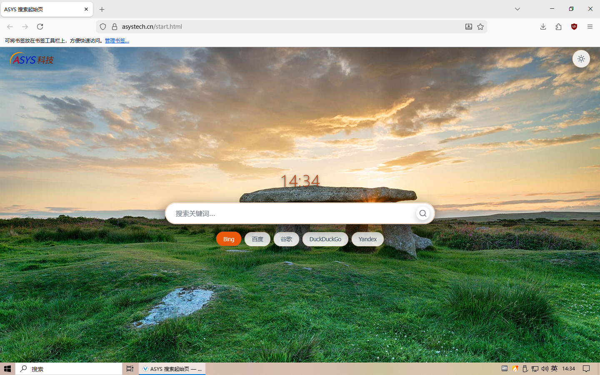

# Vantage 浏览器

> **隐私 · 快速 · 易用**

[](https://asystech.cn/pc/vdownload.html)
[](LICENSE)
[](https://github.com/asystech-chen/Vantage)

# 软件截图



---

## 📋 目录

- [什么是 Vantage？](#-什么是-vantage)
- [✨ 核心特性](#-核心特性)
- [🖥️ 系统要求](#️-系统要求)
- [📦 安装指南](#-安装指南)
- [⚙️ 配置与使用](#️-配置与使用)
- [🤝 贡献指南](#-贡献指南)
- [❓ 常见问题](#-常见问题)
- [📄 许可证](#-许可证)
- [🔗 相关链接](#-相关链接)

---

## 🔍 什么是 Vantage？

**Vantage** 是一款由 **ASYS 科技** 深度定制的 Firefox 浏览器，基于 LibreWolf 代码实现，专注于**隐私 · 快速 · 易用**。

> ⚠️ Vantage 与 LibreWolf 或 Mozilla 官方无任何隶属关系或商业合作。

我们的目标：在保留 Firefox 强大扩展生态的同时，为用户提供开箱即用的隐私增强体验，摆脱追踪、遥测与不必要的干扰。

---

## ✨ 核心特性

| 特性 | 说明 |
|------|------|
| 🚫 **无遥测** | 完全禁用 Firefox 遥测、实验功能、广告推送及数据收集模块 |
| 🔍 **灵活搜索** | 默认集成 Microsoft Bing，支持一键切换百度、谷歌、DuckDuckGo 等引擎 |
| 🛡️ **内置拦截** | 预装 uBlock Origin 等广告/追踪器拦截规则，提升页面加载速度与纯净度 |
| 🔒 **隐私加固** | 启用 RFP（Resist Fingerprinting）、禁用 WebRTC 泄露、强制 HTTPS 等硬核隐私策略 |
| 🔄 **跨端同步** | 支持登录 Mozilla 账号，无缝同步书签、扩展、主题及配置（可选启用） |
| 🔓 **开源透明** | 全部源码公开，欢迎审计、复刻与二次开发 |

---

## 🖥️ 系统要求

### Windows
- **操作系统**：Windows 10 / 11 (64 位)
- **处理器**：x64 兼容处理器
- **内存**：≥ 4 GB RAM
- **存储**：≥ 500 MB 可用空间
- **显卡**：支持 DirectX 11 的 GPU（硬件加速）

### Linux
- **发行版**：大多数主流发行版
- **依赖库**：安装包已包含常见依赖

### macOS（开发中）
> 🚧 macOS 版本正在适配中，敬请期待

---

## 📦 安装指南

### Windows 用户
1. 访问官网下载页面：[https://asystech.cn/pc/vantage.html](https://asystech.cn/pc/vantage.html)
2. 下载安装包
3. 双击运行，按向导完成安装
4. 启动 Vantage，开始隐私浏览之旅 ✨

### Linux 用户

Debian、Ubuntu等使用APT包管理器的Linux发行版
```bash
cd ~
wget https://asystech.cn/vantage/vantage-latest.deb #通过官网下载（推荐）
wget https://github.com/asystech-chen/Vantage/releases/download/148.0-1/vantage_148.0-1_amd64.deb #通过GitHub下载

sudo apt update
sudo apt install -y vantage-latest.deb

```

Rocky等RHEL发行版
```bash
cd ~
wget https://github.com/asystech-chen/Vantage/releases/download/148.0-1/vantage-148.0_1-1.x86_64.rpm #通过GitHub下载

sudo yum update
sudo yum install -y vantage-latest.rpm

```

其他发行版：使用AppImage包
```bash
cd ~
wget https://github.com/asystech-chen/Vantage/releases/download/148.0-1/vantage-148.0-1.x86_64.AppImage
chmod +x vantage-148.0-1.x86_64.AppImage
./Vantage-x86_64.AppImage
```


# 方式二：使用压缩包手动安装
```bash
tar -xjf Vantage-linux-x86_64.tar.bz2 -C /opt/
ln -s /opt/vantage/vantage /usr/local/bin/vantage
```


---

## ⚙️ 配置与使用

### 首次启动建议
- ✅ 检查 `about:preferences#privacy` 中的隐私设置
- ✅ 根据需要启用/禁用 Mozilla 同步功能
- ✅ 安装常用扩展（Vantage 兼容 Firefox 扩展商店）

### 高级配置（about:config）
> ⚠️ 修改前请备份配置，不当设置可能影响浏览器稳定性

```ini
# 示例：进一步禁用遥测（默认已禁用，供参考）
datareporting.healthreport.uploadEnabled = false
toolkit.telemetry.enabled = false
browser.ping-centre.telemetry = false

# 示例：增强 DNS over HTTPS
network.trr.mode = 3
network.trr.uri = "https://mozilla.cloudflare-dns.com/dns-query"
```

### 快捷键速查
| 快捷键 | 功能 |
|--------|------|
| `Ctrl+Shift+P` | 打开隐私浏览窗口 |
| `Ctrl+Shift+Delete` | 快速清除浏览数据 |
| `Ctrl+L` | 聚焦地址栏 |
| `F11` | 全屏模式 |


---

## 🤝 贡献指南

我们欢迎任何形式的贡献！🎉

### 你可以：
- 🐛 提交 Bug 报告（请附复现步骤与环境信息）
- 💡 提出新功能建议
- 🔧 提交 Pull Request 修复问题或增强功能
- 🌍 帮助翻译本地化内容
- 📝 完善文档与使用教程

### 贡献流程
1. Fork 本仓库
2. 创建特性分支：`git checkout -b feat/your-feature`
3. 提交更改：`git commit -am 'feat: 添加 XXX 功能'`
4. 推送分支：`git push origin feat/your-feature`
5. 发起 Pull Request

> 📌 请确保代码符合 [Mozilla 代码规范](https://firefox-source-docs.mozilla.org/code-quality/)，并通过基础测试。

---

## ❓ 常见问题

**Q: Vantage 和 Firefox / LibreWolf 有什么区别？**  
A: Vantage 基于 LibreWolf 代码基线，由 ASYS 科技针对中文用户习惯与隐私需求进行二次定制，预置更适合本地使用的搜索与拦截策略。

**Q: 扩展兼容吗？**  
A: ✅ 完全兼容 Firefox 扩展商店（addons.mozilla.org）中的扩展，可直接安装使用。

**Q: 同步功能会泄露隐私吗？**  
A: 同步功能默认关闭。如启用，数据将通过 Mozilla 服务器加密传输，我们不会额外收集同步内容。

**Q: 如何反馈问题？**  
A: 请通过 [GitHub Issues](https://github.com/ASYS-Tech/Vantage/issues) 提交，或访问官网联系客服。

---

## 📄 许可证

Vantage 浏览器主体代码遵循 **Mozilla Public License 2.0** 开源。  
部分预置扩展与资源遵循其各自许可证

> 📜 本软件按「原样」提供，不提供任何明示或暗示的担保。

---

## 🔗 相关链接

- 🌐 官网：[https://asystech.cn/vantage](https://asystech.cn/vantage)
- 💻 源码：[GitHub - ASYS-Tech/Vantage](https://github.com/asystech-chen/Vantage)
- 🐛 问题反馈：[Issues](https://github.com/asystech-chen/Vantage/issues)
- 📚 Firefox 文档：[MDN Web Docs](https://developer.mozilla.org/)

---

> 感谢 Mozilla、LibreWolf 社区及所有开源贡献者！  


