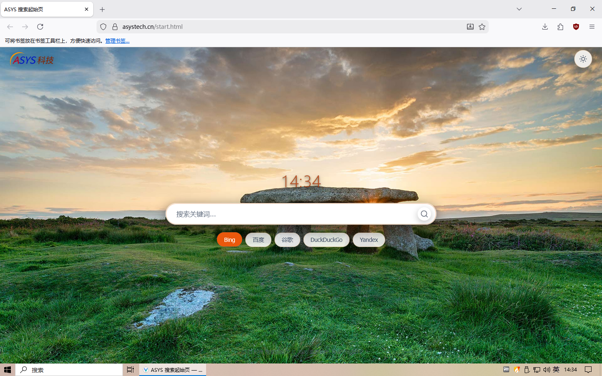

# Vantage 浏览器

> **隐私 · 快速 · 易用**

[](https://asystech.cn/vantage)
[](LICENSE)
[](https://github.com/asystech-chen/Vantage)

## 软件截图



---

## 📋 目录

- [什么是 Vantage？](#-什么是-vantage)
- [⭐ Vantage 独有优势](#-vantage-独有优势)
- [🗺️ 路线图](#️-路线图)
- [核心特性](#核心特性)
- [🖥️ 系统要求](#️-系统要求)
- [📦 安装指南](#-安装指南)
- [🔨 构建指南](#-构建指南)
- [⚙️ 配置与使用](#️-配置与使用)
- [🤝 贡献指南](#-贡献指南)
- [❓ 常见问题](#-常见问题)
- [📄 许可证](#-许可证)
- [🔗 相关链接](#-相关链接)

---

## 🗺️ 路线图

### 已迁移至 ESR 通道

Vantage 已迁移至 **Firefox ESR（Extended Support Release）** 通道，当前基线为 ESR 153：

- **更稳定**：ESR 每年仅发布一个大版本，期间只合入安全修复
- **更低维护成本**：上游变更少，补丁适配工作量降低
- **API 稳定**：autoconfig、扩展及系统集成接口不会频繁变动
- **后续路线**：跟随 ESR 153 维护版（153.0.xesr）持续更新；下一个 ESR 大版本约 2027 年

### ✨ 功能进展

| 状态 | 功能 |
|:---:|---|
| ✅ 已实现 | 工具栏「多线程下载」开关、「查找栏右上角悬浮」、右键「复制为 Markdown 链接」/「在 IE 中打开」、工具栏「恢复最近关闭」、标签自动休眠、AI 侧栏、DoH 本地优化、Nova 外观 |
| 🧪 计划中 | Windows PE 单文件自解压包、Chromium 系外链处理、更多右键增强 |

---

## 🔍 什么是 Vantage？

**Vantage** 是一款由 **ASYS 科技** 深度定制的浏览器，以 **Firefox ESR** 为内核基线，专注于**隐私 · 快速 · 易用**。

> ⚠️ Vantage 与 LibreWolf 或 Mozilla 官方无任何隶属关系或商业合作。

我们的目标：在保留 Firefox 强大扩展生态的同时，为用户提供开箱即用的隐私增强体验，摆脱追踪、遥测与不必要的干扰。

---

## ⭐ Vantage 独有优势

> 在 Firefox ESR 基础上，面向中文用户与本地网络环境做的深度定制。

| 优势 | 说明 |
|---|---|
| 🎯 **ESR 稳定内核** | 基于 Firefox ESR 通道，内核长期稳定；Vantage 功能持续加入，版本会不断更新 |
| 🌏 **本地网络优化** | 默认开启 DoH（阿里 / 腾讯，故障自动回退系统 DNS），可切换供应商，内网 / VPN 不断网 |
| 🤖 **AI 侧栏开箱即用** | 内置 DeepSeek / 通义千问 / 豆包，侧栏即开即用 |
| 🧊 **Nova 新外观** | 内置 Nova 界面 + Vantage 蓝绿主题，设置面板一键切换 |
| ⚡ **多线程下载** | 内置多线程下载，工具栏按钮一键开关 |
| 🔍 **查找栏右上角悬浮** | 可选把查找栏移到右上角，Chromium 式紧凑 `x/y` 计数 |
| 🀄 **中文深度适配** | 中文安装器与界面，默认区域 CN，并附额外中文语言包 |
| 🧷 **右键增强** | 「复制为 Markdown 链接」、「在 IE 中打开」（Windows） |
| 🛌 **标签自动休眠** | 内存紧张时自动休眠不活跃标签页，释放内存 |
| 🚫 **默认无遥测** | 完全禁用遥测、实验功能与广告推送 |
| 🧩 **预装 uBlock Origin** | 预装内容拦截扩展，可选安装更多隐私增强扩展 |
| 🖥️ **全平台多渠道** | Windows（x64/arm64）、Linux（x86_64/aarch64/LoongArch64）；winget / MSIX / deb / rpm / AppImage / 便携版 |
| 📦 **LTO / PGO 构建** | 采用 LTO / PGO 编译并裁剪语言包，提升运行性能、精简包体积 |

---

## 核心特性

**性能与体验**

- 多架构原生支持：Windows x64 / arm64、Linux x86_64 / aarch64 / LoongArch64
- AI 侧栏：内置 DeepSeek、通义千问、豆包，侧栏即开即用
- 工具栏「恢复最近关闭」「多线程下载」等按钮，标签页滚轮切换、双击关闭
- 内存紧张时自动休眠不活跃标签页
- 多渠道安装：winget / MSIX / deb / rpm / AppImage / 便携版

**隐私与安全**

- 完全禁用遥测、实验功能与广告推送，默认无数据收集
- RFP 指纹保护、WebRTC 防泄露、强制 HTTPS
- 默认开启 DoH（阿里 / 腾讯国内优化，故障自动回退系统 DNS）
- 预装 uBlock Origin，可选隐私增强扩展

**易用与定制**

- `about:preferences#vantage` 专属设置面板，集中管理更新检查、AI、隐私策略
- 灵活搜索引擎：内置多引擎（含百度等国内选择），可切换谷歌、DuckDuckGo 等
- 可选启用 Mozilla 账号同步书签与扩展
- 开源透明：MPL-2.0 许可证，源码公开可审计

---

## 🖥️ 系统要求

### Windows
- **操作系统**：Windows 10 / 11 (64 位)
- **处理器**：x64 兼容处理器
- **内存**：≥ 4 GB RAM
- **存储**：≥ 500 MB 可用空间
- **显卡**：支持 DirectX 11 的 GPU（硬件加速）

### Linux
- **x86_64**：大多数主流发行版（Debian / Ubuntu / Fedora / Arch 等）
- **aarch64**：ARM64 设备（树莓派、部分国产 ARM 平台等）
- **LoongArch64**：龙芯 3A6000+ 及兼容处理器，支持 Debian Ports / Arch Linux
- **依赖库**：安装包已包含常见依赖；播放哔哩哔哩等网站的 H.264/AAC 视频还需要系统 FFmpeg（libavcodec）。deb/rpm 包均为此声明了推荐依赖（apt/dnf/zypper 默认会安装），Fedora、openSUSE 官方源即可满足，RHEL/Rocky/Alma 需先启用 RPM Fusion；AppImage/便携版请手动安装，参见常见问题

---

## 📦 安装指南

### Windows 用户
1. 访问官网下载页面：[https://asystech.cn/vantage](https://asystech.cn/vantage)
2. 下载安装包
3. 双击运行，按向导完成安装
4. 启动 Vantage，开始隐私浏览之旅 ✨

### Linux 用户

从[官网](https://asystech.cn/vantage)或 [Releases](https://github.com/asystech-chen/Vantage/releases/latest) 下载对应安装包（文件名格式：`vantage_<版本>_<架构>.deb`、`vantage-<版本>.<架构>.rpm`、`vantage-<版本>.<架构>.AppImage`）。

**Debian / Ubuntu（deb）**
```bash
cd ~
sudo apt update
sudo apt install -y ./vantage_*_amd64.deb
```

**Fedora / RHEL / Rocky（rpm）**
```bash
cd ~
sudo dnf install -y ./vantage-*.x86_64.rpm
```
> openSUSE 用 `sudo zypper install`；RHEL / Rocky / Alma 安装后如需播放 H.264 视频，请启用 RPM Fusion（见常见问题）。

**其他发行版（AppImage）**
```bash
chmod +x vantage-*.x86_64.AppImage
./vantage-*.x86_64.AppImage
```

**压缩包手动安装（tar.xz / tar.gz）**
```bash
tar -xf vantage-<版本>.linux-x86_64.tar.xz -C /opt/
ln -s /opt/vantage/vantage /usr/local/bin/vantage
```


---

## 🔨 构建指南

### 使用 build.sh

```bash
# 交互式选择编译目标
./build.sh

# 指定目标编译
./build.sh linux-x64 linux-arm64 linux-loong64
./build.sh windows-x64 windows-arm64

# 简写
./build.sh lx      # linux-x64
./build.sh la      # linux-arm64
./build.sh ll      # linux-loong64
./build.sh wx      # windows-x64
./build.sh wa      # windows-arm64

# 仅打包（跳过编译）
./build.sh package linux-x64

# 仅签名已生成产物（跳过编译和打包，仅 Linux）
./build.sh sign linux-x64
```

编译流程自动包含：**编译 → 打包 → 签名**（Linux 目标生成 deb / rpm / AppImage / tar.gz 四格式并附带 GPG 签名）。

### 手动编译

```bash
MOZCONFIG=$(pwd)/assets/mozconfig.new make build            # Linux x86_64
MOZCONFIG=$(pwd)/assets/mozconfig.linux-arm64 make build    # Linux arm64
MOZCONFIG=$(pwd)/assets/mozconfig.linux-loong64 make build  # Linux LoongArch64
MOZCONFIG=$(pwd)/assets/mozconfig.win-cross make build      # Windows x64（交叉编译）
MOZCONFIG=$(pwd)/assets/mozconfig.win-cross.arm64 make build # Windows arm64（交叉编译）
```

### LoongArch64 交叉编译

详见 [`docs/LOONG64-CROSS-COMPILE.md`](docs/LOONG64-CROSS-COMPILE.md)

---

## ⚙️ 配置与使用

### 首次启动建议
- ✅ 访问 `about:preferences#vantage` 了解 Vantage 专属设置（更新检查、AI 侧栏、隐私策略等）
- ✅ 检查 `about:preferences#privacy` 中的隐私设置
- ✅ 根据需要启用/禁用 Mozilla 同步功能
- ✅ 安装常用扩展（Vantage 兼容 Firefox 扩展商店）

### 高级配置（about:config）
> ⚠️ 修改前请备份配置，不当设置可能影响浏览器稳定性

```ini
# 示例：进一步禁用遥测（默认已禁用，供参考）
datareporting.healthreport.uploadEnabled = false
toolkit.telemetry.enabled = false
browser.ping-centre.telemetry = false

# 示例：DNS over HTTPS（Vantage 默认已启用国内 DoH，此处仅供自定义参考）
network.trr.mode = 3
network.trr.uri = "https://dns.alidns.com/dns-query"    # 阿里 DNS
# network.trr.uri = "https://doh.pub/dns-query"         # 腾讯 DNSPod
```

---

## 🤝 贡献指南

我们欢迎任何形式的贡献！🎉

### 你可以：
- 🐛 提交 Bug 报告（请附复现步骤与环境信息）
- 💡 提出新功能建议
- 🔧 提交 Pull Request 修复问题或增强功能
- 🌍 帮助翻译本地化内容
- 📝 完善文档与使用教程

### 贡献流程
1. Fork 本仓库
2. 创建特性分支：`git checkout -b feat/your-feature`
3. 提交更改：`git commit -am 'feat: 添加 XXX 功能'`
4. 推送分支：`git push origin feat/your-feature`
5. 发起 Pull Request

> 📌 请确保代码符合 [Mozilla 代码规范](https://firefox-source-docs.mozilla.org/code-quality/)，并通过基础测试。

---

## ❓ 常见问题

**Q: Vantage 和 Firefox / LibreWolf 有什么区别？**  
A: Vantage 以 **Firefox ESR** 为内核基线（早期基于 LibreWolf 代码实现），由 ASYS 科技针对中文用户习惯与隐私需求进行二次定制，预置更适合本地使用的搜索与拦截策略。

**Q: 扩展兼容吗？**  
A: ✅ 完全兼容 Firefox 扩展商店（addons.mozilla.org）中的扩展，可直接安装使用。

**Q: 同步功能会泄露隐私吗？**  
A: 同步功能默认关闭。如启用，数据将通过 Mozilla 服务器加密传输，我们不会额外收集同步内容。

**Q: Linux 下打不开哔哩哔哩 / 视频网站提示浏览器不支持播放？**  
A: Linux 上的 Firefox 系浏览器依赖**系统 FFmpeg（libavcodec）**解码 H.264/AAC；缺少这个库时，视频站会判定浏览器不支持播放。Windows 版使用系统内置解码组件，不受影响。安装方法：

```bash
# Debian / Ubuntu（deb 包已声明推荐依赖，一般无需手动安装）
sudo apt install ffmpeg
# Fedora（官方源）
sudo dnf install ffmpeg-free openh264
# openSUSE（官方源）
sudo zypper install ffmpeg-7
# RHEL / Rocky / Alma（需先启用 RPM Fusion）
sudo dnf install ffmpeg
```

安装后重启浏览器即可。

**Q: 如何反馈问题？**  
A: 请通过 [GitHub Issues](https://github.com/asystech-chen/Vantage/issues) 提交，或访问官网联系客服。

---

## 📄 许可证

Vantage 浏览器主体代码遵循 **Mozilla Public License 2.0** 开源。  
部分预置扩展与资源遵循其各自许可证

> 📜 本软件按「原样」提供，不提供任何明示或暗示的担保。

---

## 🔗 相关链接

- 🌐 官网：[https://asystech.cn/vantage](https://asystech.cn/vantage)
- 💻 源码：[GitHub - asystech-chen/Vantage](https://github.com/asystech-chen/Vantage)
- 🐛 问题反馈：[Issues](https://github.com/asystech-chen/Vantage/issues)
- 📚 Firefox 文档：[MDN Web Docs](https://developer.mozilla.org/)

---

> 感谢 Mozilla、LibreWolf 社区及所有开源贡献者！  


